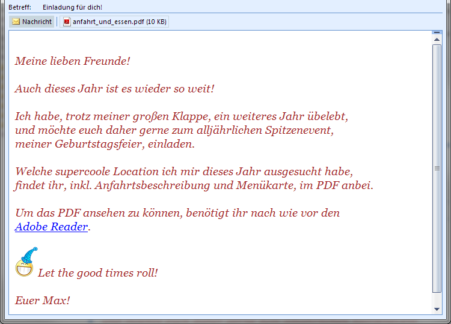

    Von: Max Spendabel 
    An: meine.freunde@example.org 
    Betreff: Einladung für dich! 
    Anhang: anfahrt_und_menüplan.pdf 

<i>
     
    Meine lieben Freunde! 
     
    Auch dieses Jahr ist es wieder so weit!  
     
    Ich habe, trotz meiner großen Klappe, ein weiteres Jahr übelebt, 
    und möchte euch daher gerne zum alljährlichen Spitzenevent,  
    meiner Geburtstagsfeier, einladen.  
     
    Welche supercoole Location ich mir dieses Jahr ausgesucht habe, 
    findet ihr, inkl. Anfahrtsbeschreibung und Menükarte, im PDF anbei.  
     
    Um das PDF ansehen zu können, benötigt ihr den 
    <a href="http://get.adobe.com/de/reader/" target="_blank" rel="nofollow">Adobe Reader</a>.
      
     
     Let the good times roll! 
     
     
    Euer Max!
</i>

---
  
  
Wollte Max dieses E-Mail per PHP schicken, würde Ihm das wohl ziemlich viel Mühe bereiten. Als erstes hätten Ihn vermutlich die Umlaute geärgert. Im Text und vor allem im Betreff, überall Umlaute. Ein Charset-Header muss her. Oder gar eine ISO-Codierung fürs Subject? Dann fällt ihm ein, dass er ja noch ein fetziges Bild und unbedingt den Link zum Adobe Reader einbauen will ― schließlich sollen es seine Freunde ja so einfach wie möglich haben. Außerdem kommen die  doch vermutlich erst mit bunter Schrift so richtig in Feierlaune. Fazit: eine HTML-Mail muss her. Dann noch das Wichtigste: Der PDF-Anhang! 
Mime-Types, Content-Types, Transfer-Encodings, Boundaries… Vielleicht alles noch als Plain text? Sicher ist sicher?

Max raucht der Kopf. „Gott“, denkt er sich, „da bin ich ja bis nächstes Jahr noch nicht fertig, da kann ich meine fetzigen, modernen Einladungs-E-Mails vergessen".

Doch halt! Von ferne schallt Rat der Weisen! „Mailing Klasse“ flüstern Sie in sein Ohr. Max fragt kurz Tante Google und plötzlich ist alles ganz einfach. Einmal fix die Hilfe aufgerufen und ein paar Kommandos abgepinselt:

~~~ php
require_once __DIR__.'/Swift-5.0.1/lib/swift_required.php';

$from        = 'max.spendabel@example.org'; 
$to          = 'meine.freunde@example.org'; 
$subject     = 'Einladung für dich!'; 
$attachment  = 'anfahrt_und_essen.pdf'; // muß im selben Verzeichnis liegen 
$smiley      = 'party_smiley.png';      // muß im selben Verzeichnis liegen 

// Als erstes brauchen wir ein Objekt für unsere Nachricht 
$message = Swift_Message::newInstance($subject); 

// Die bekommt gleich Absender und Empfängerangabe (Kurznotation über Queuing geht auch) 
$message->setTo($to); 
$message->setFrom($from); 

// bild muß für die Email mit ID eingebettet werden 
$cid = $message->embed(Swift_Image::fromPath($smiley)); 

// ein gutes Schreiben ist die halbe Miete 
$message->setBody(
'<!DOCTYPE html>
<head>
    <title>Einladung</title>
    <meta charset="utf-8">
</head>
<body>

<i>
 
    Meine lieben Freunde! 
     
    Auch dieses Jahr ist es wieder so weit!  
     
    Ich habe, trotz meiner großen Klappe, ein weiteres Jahr übelebt, 
    und möchte euch daher gerne zum alljährlichen Spitzenevent,  
    meiner Geburtstagsfeier, einladen.  
     
    Welche supercoole Location ich mir dieses Jahr ausgesucht habe, 
    findet ihr, inkl. Anfahrtsbeschreibung und Menükarte, im PDF anbei.  
     
    Um das PDF ansehen zu können, benötigt ihr nach wie vor den 
    <a href="http://get.adobe.com/de/reader/" target="_blank" rel="nofollow">Adobe Reader</a>.
      
     
     Let the good times roll! 
     
     
    Euer Max!
</i>

</body>'
, 'text/html'); 
   
// Das PDF 
$message->attach(Swift_Attachment::fromPath($attachment)); 

// Hier bestimmen wir die Sendemethode. Fortgeschrittene benutzen besser SMTP 
$transport = Swift_MailTransport::newInstance(); 

// Unser Mailerobjekt wird mit der Sendemethode erzeugt 
$mailer = Swift_Mailer::newInstance($transport); 

// Und schon geht die Nachricht auf die Reise 
if ($mailer->send($message)) { 
  echo 'Hurra.'; 
} else { 
  echo 'Fehler! Schnell F5 drücken!!'; 
} 
~~~

Die Klasse flugs auf dem Server installiert, Pfade angepasst und das Dauerfeuer kann losgehen; Herz was willst du mehr?

  

  
  
Überblick der aktuell publiken Mailer-Klassen-Kandidaten:

[http://swiftmailer.org/](http://swiftmailer.org/)  
[http://sourceforge.net/projects/phpmailer/](http://sourceforge.net/projects/phpmailer/)  
[http://pear.php.net/package/Mail/](http://pear.php.net/package/Mail/)  

Auch Zend und ezComponents stellen Mailer bereit, die aber nur in Verbindung mit den jeweiligen Umgebungen funktionieren.

Es gibt also mehr als den altbekannten PHPMailer. Das da oben war ― unschwer zu erkennen ― die Swiftmailer-Klasse in der 5er Version.

Drei Ergänzungen noch:  

1. Natürlich müßt Ihr den Absender an Eure Domain anpassen. Sonst verweigert euer Mailserver noch die Auslieferung. Oder schlimmer: Die Einladung geht an jemanden Falschen!
 
2. Schützt Eure Verzeichnisse! Oder wollt Ihr auch noch von Fremden ungeliebte Geschenke?  

3. SwiftMailer benutzt Exceptions. Für alle Fälle solltet Ihr also alles per try/catch umschließen. Leider wird das in Beispielcodes (konsequent auch in meinem oben) in der Regel vergessen. 

PS: Wer jetzt immer noch uneinsichtig fragt, was denn an mail() so verkehrt ist, der möge sich in einer heimeligen Adventsstunde mal [sämtliche RFCs zum Thema E-Mail](http://php-de.github.io/email/standard-mail-validation.html#rfc-zum-thema-e-mail) zu Gemüte führen. Und sich fragen, ob er all diese Vorschriften mal locker aus dem Handgelenk programmiert, wofür etablierte Mailingklassen hunderte Scripte bereitstellen. Auch für einfache Textnachrichten lohnt sich der Griff zur Mailer-Klasse. Nur Mut.

Frohes Mailen!
