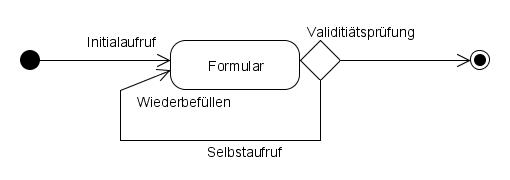
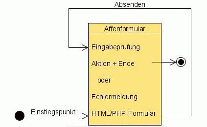

Das sogenannte **Affenformular** ist eine Codebasis bei der Verarbeitung von Webformularen. Sein Hauptzweck ist die Erstellung einer grundlegenden Formularverarbeitung: Darstellung eines Forms, Prüfung des Status, Selbstaufruf mit wiederaufgefüllten Eingabefeldern. 

 

In jedem Fall registriert ein solcher Code einen erfolgreichen Submit (i.A. einen [POST Request](http://php-de.github.io/request-handling/request.html#post)) und führt eine Folgeaktion (Parameterverarbeitung oder erneutes Darstellen des Formularcodes) aus. Ob eine [Validierung](http://php-de.github.io/general/validierung.html) der übertragenen Feldwerte noch zum Affenformular gehört ist Ansichtssache. 

### Abgrenzung

Im Vergleich zu klassischer, einfacher Formularverarbeitung – Script 1 stellt Formular dar, ein Submit führt nach Script 2, das die Verarbeitung übernimmt – ergibt sich im Affenformular-Verfahren vor allem ein Mehrwert für den Anwender: das Wiederauffüllen von Feld-Werten. Das Script bietet damit 

- Fehlertoleranz: Die Bearbeitung erfolgt erst, wen der Nutzer "fertig" ist. Lange Formulare können innerhalb einer Sitzung so theoretisch auch in Etappen eingegeben werden. 
- Hilfestellung: Der Nutzer kann durch die erfolgende Validierung auf Fehleingaben und fehlende Angaben hingewiesen werden. Anhand dem Script bekannter Eingabetypen können sogar erwartete Wertebereiche und -arten als Unterstützung eingeblendet werden. 

Beide Punkte werden durch eine klassische Fomularverarbeitung allenfalls ansatzweise erreicht. Der wichtige Faktor des Wiederauffüllens von Eingabefeldern kann dort nur durch JavaScript-basierte Rückwärtslinks oder den Back-Button des Browsers erreicht werden und ist damit von der Funktionalität des verwendeten Browsers abhängig. 

### Herleitung aus einer Standard-Formularverarbeitung
 
Am Anfang steht die klassische Formularverarbeitung. Wir haben ein HTML-basiertes Formularscript, dessen Form-Action auf ein serverbasiertes Aktionsscript verweist. Ein Button erzeugt einen Request auf dieses Script und startet dessen Aktion. 

 

Das Aktionsscript prüft die Eingabe und zeigt bei fehlenden oder fehlerhaften Daten eine Meldung an. Anderenfalls werden die Daten verarbeitet. Aus Nutzeraspekten ist so ein Script unglücklich gebaut, da der Nutzerwunsch ja die Ausführung der Scriptaktion mit seinen Eingabedaten ist. Im Fehlerfall ist die Art der Rückmeldung, erst recht die Möglichkeit zur Anpassung der Eingabedaten hier bescheiden: Meldungstexte und Browser-Back-Button. 

Mehr Komfort bietet ein dynamisches Formular, das bei fehlerhaften Daten die bisherigen Daten in einem baugleichen Formular wieder darstellt. Für den Nutzer ergibt sich der Eindruck, das Formular würde erneut angezeigt. 

 
 
Das Eingabescript wird hierbei dupliziert und mit einem dynamischen Teil (Befüllen der Eingabeelemente mit Vorgabewerten) erweitert. Die Aktion zeigt weiterhin auf das ursprüngliche Aktionsscript. Selbiges prüft, ob es eine Folgeaktion (Datenverarbeitung) ausführt oder das dynamische Formular darstellt. Beide Komponenten können dabei durchaus zusammen in einem Script als Bedingungsblöcke notiert sein. 

Nun stellt sich die Frage, ob nicht ein Formular beide Zwecke erfüllen kann, die Initialanzeige (leer) und die Fehleranzeige (befüllt). Erhält unser dynamisches Formular eine Auswertung der Art seines Aufrufs, kann es an die Stelle des initialen Formulars treten und man spart damit ein Script ein. Und noch viel wichtiger: Doppelungen, bspw. bei der Änderung der Formularmaske entfallen. 

Führt man diesen Schritt konsequent weiter, kann auch die Aktionsfunktionen mit in das Script integrieren. Das ist sinnvoll, weil unser dynamisches Formularscript ohnehin schon Informationen über den Zustand der aktuellen Formularverarbeitung verwaltet. Die Aktion unseres Formulars zeigt also auf das aktuelle Script. 

### Umsetzung
 
Das Grundprinzip des Affenformulars ist der Selbstaufruf des Scripts. Die bisher auf ein Sende- und ein Empfängerscript verteilten Aufgaben - Form-Darstellung und Parameterableitung/Datenverarbeitung - geschehen nun in einem gemeinsamen Script. Damit ergibt sich eine neue Grundstruktur, da das Script nun verschiedene Zustände (entsprechend der nötigen Aufgabe) annehmen muß. 

<strong>Information: </strong>Innerhalb dieses Kapitels wird stets von "einem Script" gesprochen. Gemeint ist hier aber eine gemeinsame funktionale Einheit verschiedener Komponenten. Natürlich können die einzelnen Bestandteile (Formular HTML, Validierungsfunktion, Logik) durchaus auch auf mehrere Scripte verteilt und via <code>include</code> verbunden werden.

#### Erkennen des Submit
Entscheidend für die Funktion des Affenformulars ist die Unterscheidung zweier Zustände: des Erstaufrufs und der Formularabsendung. 

Ein Script, das erstmalig aufgerufen wird, kann daran zu erkennen sein, dass es meist als GET Request angefordert werden. Ein besseres Unterscheidungsmerkmal bildet aber ein übertragener Elementinhalt (Form Button oder sonstiges Eingabefeld), der bei einem Erstaufruf nicht übertragen wird. Erst bei Absenden des Formulars, tritt das Element und sein Wert als Teil der Requestparametermenge auf. 

Aufgrund Ihrer spezifischen Eigenschaften sind alle Form-Elemente außer Checkboxes und Selectfelder für die Unterscheidung des Status geeignet. Eine Erklärung dafür findet sich weiter unten. 

##### Problematik Enter-Taste

Als allgemein üblich hat sich die Prüfung eines Submit-Buttons eingebürgert. Bsp. 

~~~ php
if (!empty($_POST['Name_des_Buttons'])) {
    // Formular abgesendet
    // Zweig Formularverarbeitung
} else {
    // Erstaufruf
    // Zweig Formulardarstellung
}
~~~

Diese Lösung schein zunächst offensichtlich, schließlich dient der Submit-Button einzig dem Zweck, ein Formular abzuschicken. Ein spezielle Browserverhalten führt aber zu Problemen: Viele Browser unterstützen auch das Absenden eines Formulars durch Drücken der Enter-Taste in einem Input-Text-Feld. Je nach Browserverhalten, wird in diesem Fall zwar das Formular abgeschickt (Submit), der vorhandene Submit-Button allerdings nicht betätigt. Infolgedessen taucht der Buttonwert nicht in der Menge der Requestparameter auf und die Formularverarbeitung wird nicht ausgeführt. 

Um das Problem zu umgehen, kann z.B. ein normales oder verstecktes Textfeld als auslösendes Element verwendet werden. Dabei ist ein Eintrag im Feld unerheblich, da auch leere Werte von Textfeldern als Wertepaar `Textfeldname => NULL` in der Parametermenge auftauchen und über Vorhandensein des Schlüssels erkannt werden können. 

~~~ php
if (isset($_POST['Name_des_Textfelds'])) {
    // Formular abgesendet
    // Zweig Formularverarbeitung
} else {
    // Erstaufruf
    // Zweig Formulardarstellung
}
~~~

#### Wiederbefüllen/Wiederauswahl der Elemente

Für die Umsetzung des Abschicken & Wiederauffüllen-Verfahrens müssen die unterschiedlichen Verhalten der HTML Eingabefelder berücksichtigt werden. Besonderes Augenmerk verdienen hier nicht ausgewählte Checkboxen und Radiobuttons, deren Werte beim Submit nicht übertragen werden. 

Die Grundlagen zur Übergabe von Formular-Parameterdaten sind bereits unter [Formularverarbeitung](http://php-de.github.io/form/form.html) beschrieben. Nachfolgend wird darauf aufbauend die Wiederbelegung der Elemente beschrieben. 

##### Textfeld und Inputfeld 
Hauptartikel [Formularverarbeitung Textfelder](http://php-de.github.io/form/textfelder.html) 

Die unkomliziertesten Felder. Die Ausgabe erfolgt im value Attribut bzw. zwischen den Tags. Bitte Kapitel *Problematik HTML Sonderzeichen* beachten. 

~~~ php
<input type="text" name="Textfeld" value="<?php echo $_POST['Textfeld']; ?>">
<textarea name="Textbox"><?php echo $_POST['Textbox']; ?></textarea>
~~~

##### Auswahlelemente
Hauptartikel Formularverarbeitung [Auswahlfelder](http://php-de.github.io/form/auswahlfelder.html) | [Auswahllisten (Selections)](http://php-de.github.io/form/auswahllisten.html) 

Für alle anderen Elemente muß die jeweilige Auswahl durch ein spezielles Attribut (je nach Typ checked oder selected) gekennzeichnet werden. Das Vorgehen unterscheidet sich lediglich im Datentyp, das das Element liefert. 

##### Problematik HTML Sonderzeichen
Besondere Vorsicht ist bei den Elementtypen Textfeld und Inputfeld geboten: Während bei allen anderen Elementen die Übergabeparameter nur durch PHP verglichen werden, werden hier direkt Daten in den Browserquelltext geschrieben. Da PHP vor dem Browserrendering geschieht, kann dieser natürlich nicht zwischen umschließendem HTML-Formcode und Eingabedaten unterscheiden. 

Beinhaltet die Eingabe also einen Stringbegrenzer (" oder ') "sprengt" dies die Attributbegrenzung. Bsp: 

~~~ php
<?php
$eingabe = 'Peter sagte "Halt!"';
?>
<input type="text" value="<?php echo $eingabe; ?>">
~~~

ergäbe

~~~ php
<input type="text" value="Peter sagte "Halt!"">
~~~

wobei der Browser *"Peter sagte "* als Attributwert für *value* interpretierte. Ein folgendes > würde auch das input Element verlassen usw. 

Analog kann über einen unbearbeiteten Parameter auch Stylesheet-Formatierung oder - weit mächtiger - JavaScript Code in das Script eingeschleust werden. Dieses Verfahren nennt man [Cross Site Scripting](http://php-de.github.io/general/cross-site-scripting.html). 

Abhilfe schafft bspw. die Bearbeitung des Eingabewertes mit `htmlentities()`. Dieser wandelt HTML Syntaxbestandteile in eine sogenannte Entity (einen HTML Ersatzcode) um, der vom Browser nur in der Anzeige als das gewünschte Zeichen gerendert wird. Obiges Beispiel erzeugte beispielsweise die HTML Ausgabe: 

~~~
<input type="text" value="Peter sagte &quot;Halt!&quot;"> 
~~~

<strong>Achtung: </strong>Die vorliegenden Ausführungen sind auf das Funktionsprinzip reduziert. Eine Formularverarbeitung und -darstellung setzt zwingend eine Beschäftigung mit Unsicherheitsfaktoren wie <a href="http://php-de.github.io/general/cross-site-scripting.html">XSS</a> voraus!

